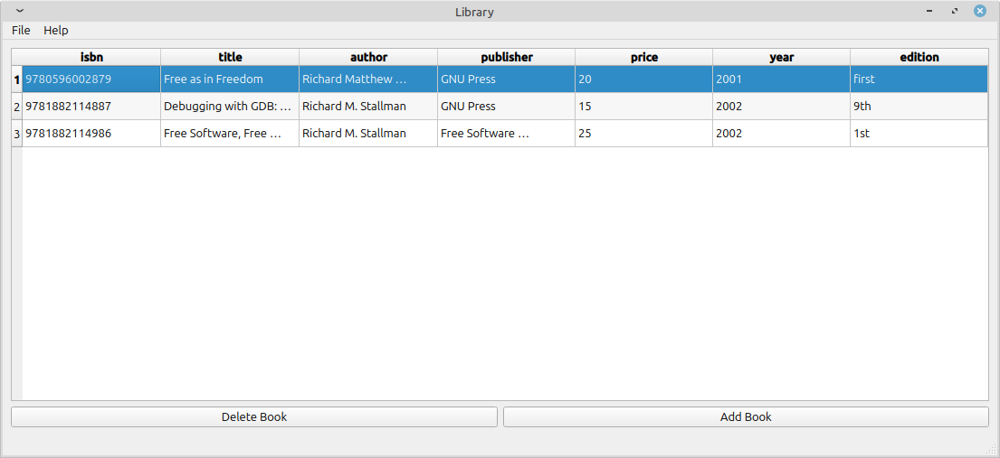
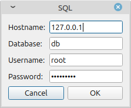

# LibraryQt

A program for managing a library.

<p align="center">
  
</p>

1- Create the books table in the MySQL/MariaDB database: 
```bash
CREATE TABLE books (
    isbn CHAR(13) NOT NULL,
    title VARCHAR(255) NOT NULL,
    author VARCHAR(255) NOT NULL,
    publisher VARCHAR(255) NOT NULL,
    price DECIMAL(65,2) NOT NULL,
    year SMALLINT UNSIGNED NOT NULL,
    edition VARCHAR(50) NOT NULL,
    PRIMARY KEY (isbn)
);
``` 

2 - Compile LibraryQt
```bash
$ cmake .
$ make
```

3 - Run LibraryQt
```
$ ./SQL
```

4 - Enter the hostname, database, username and password, and click OK. Example:

<p align="left">
  
</p>
